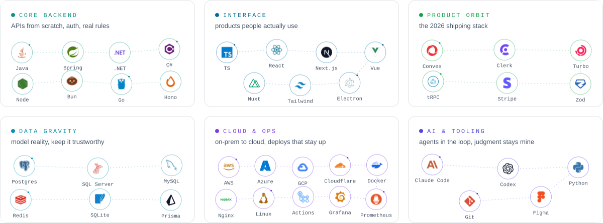

<a href="https://jair.nightly.mx">
  <picture>
    <source media="(prefers-color-scheme: dark)" srcset="assets/header-dark.svg">
    
  </picture>
</a>

  <a href="https://jair.nightly.mx"><b>🌕 Portfolio</b></a> &nbsp;·&nbsp;
  <a href="https://jair.nightly.mx/explore"><b>🛰️ Explore in 3D</b></a> &nbsp;·&nbsp;
  <a href="https://linkedin.com/in/jair-ch%C3%A1vez-islas-a4283820a"><b>LinkedIn</b></a> &nbsp;·&nbsp;
  <a href="mailto:chamaco_03@hotmail.es"><b>Email</b></a> &nbsp;·&nbsp;
  <a href="https://jair.nightly.mx/Jair_Ch%C3%A1vez_Islas_CV.pdf"><b>CV</b></a>

Computer Systems Engineer and partner at **[NightlySoftware](https://nightly.mx)**. I build across backend, frontend, data, cloud and infrastructure, from government systems that run real legislative processes to products I ship with my brother and my best friends. My route into software wasn't linear, and I like it that way.

🇲🇽 <b>En español</b>

 

Ingeniero en Sistemas Computacionales, desarrollador fullstack y socio en **NightlySoftware**. Trabajo con backend, frontend, bases de datos, cloud, DevOps e infraestructura; no como una lista perfecta, sino como una búsqueda constante hasta construir criterio propio. Hoy mantengo sistemas institucionales en el Congreso de Guanajuato, construyo producto con mi hermano y empujo a Nightly hacia su siguiente escala.

&nbsp;

## ✦ Orbit log

Every station is a real stage: influences, doubts, changes of direction, teams and the skills that shaped how I build.

<picture>
  <source media="(prefers-color-scheme: dark)" srcset="assets/route-dark.svg">
  
</picture>

## ✦ Mission archive

| | Mission | What it is | Stack |
|:-:|---|---|---|
| 🟢 | **Cleanly** · 2026 → now | Operations platform for professional cleaning services: express quotes, client / cleaner / admin roles, photo evidence and payments. My first paid product with my brother. | Next.js · Convex · Clerk · Turborepo · Bun |
| 🟣 | **E‑voting, Congreso GTO** · 2025 → now | Legislative voting system with biometrics and real-time results. In production since Nov 2025; I keep it in orbit. | .NET · SignalR · React · AWS Rekognition · Cognito · SQL Server |
| 🟣 | **Verdict** · 2026 | Offline desktop app for auditing large legal case files, with local full-text search, PDF review and annotations. | Electron · Next.js · SQLite · React PDF · Zustand |
| 🟣 | **Command** · 2026 | Dev ticketing for institutional teams: intake, assignment, conversation and reports. | Backend · Chat · Reporting |
| 🟢 | **Pixel Office** · 2026 | A Habbo-style pixel office that comes alive with real GitHub repository activity. | Bun · Hono · Go · Redis · Canvas |
| 🔵 | **Passify** · 2024 → paused | Digital wallet passes with multitenancy on PostgreSQL RLS, plans and payments. Ambitious, still open. | Spring Boot · PostgreSQL RLS · Next.js · tRPC · Stripe |
| 🟡 | **Tramet** · 2024 | My first paid project: an admin platform with the backend built from scratch. | Spring Boot · Next.js · MySQL · Docker · Actions |
| 🟡 | **Munchez** · 2023 | Cafeteria system (POS, kitchen, admin, reports) built with my best friend. | React · Spring Boot · MySQL · JWT · Flyway |

🟡 community &nbsp; 🔵 Nightly &nbsp; 🟣 institutional &nbsp; 🟢 product. Full case studies live on <a href="https://jair.nightly.mx">jair.nightly.mx</a>.

### 💣 Open-source launch

**[github-contribution-minesweeper](https://github.com/Jair0305/github-contribution-minesweeper)**: a GitHub Action I built that turns any contribution graph into a self-solving Minesweeper game. Every commit day becomes a mine. It's running at the bottom of this page.

## ✦ Tech constellations

<picture>
  <source media="(prefers-color-scheme: dark)" srcset="assets/stack-dark.svg">
  
</picture>

## ✦ Telemetry

<picture>
  <source media="(prefers-color-scheme: dark)" srcset="assets/telemetry-dark.svg">
  
</picture>

## ✦ The grid, played two ways

<picture>
  <source media="(prefers-color-scheme: dark)" srcset="https://raw.githubusercontent.com/Jair0305/Jair0305/output-minesweeper/minesweeper-dark.svg">
  
</picture>

<picture>
  <source media="(prefers-color-scheme: dark)" srcset="https://raw.githubusercontent.com/Jair0305/Jair0305/output-snake/github-snake-dark.svg">
  
</picture>

All artwork on this page is generated by <a href="scripts/build.mjs"><code>scripts/build.mjs</code></a> with zero dependencies and refreshed daily by GitHub Actions. No third-party widgets.

